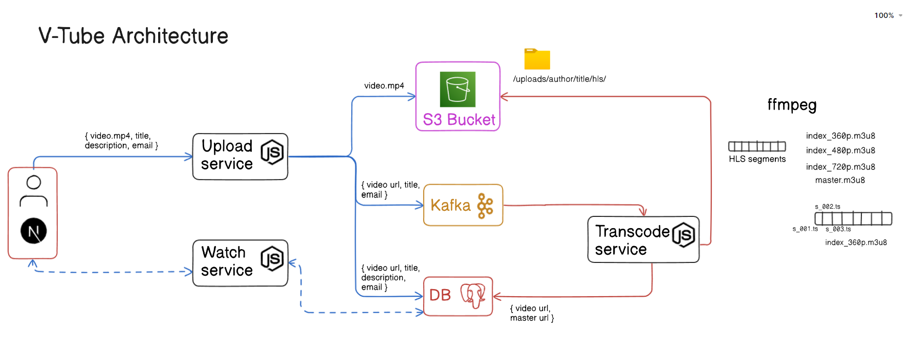

# V-Tube

V-Tube is a video processing and streaming system with multiple services, handling video upload, transcoding, and delivery
efficiently

## Tech Stack

- **Node.js**, **Express.js**, **Next.js**, **PostgreSQL**, **Kafka**, **S3**

## Local Setup

Clone the repo

```bash
https://github.com/SanjayM-2002/vtube.git
```

Start Kafka locally

```bash
docker run -p 9092:9092 apache/kafka:3.8.0
```

Set up .env in every service:

```bash
cd upload-service
PORT = 5000
ACCESS_KEY =
ACCESS_KEY_SECRET =
BUCKET_NAME = ""
DATABASE_URL =
npm i
```

```bash
cd transcoder-service
PORT = 5002
ACCESS_KEY =
ACCESS_KEY_SECRET =
BUCKET_NAME = ""
DATABASE_URL =
npm i
```

```bash
cd watch-service
PORT = 5001
DATABASE_URL =
npm i
```

```bash
cd client
NEXT_PUBLIC_UPLOAD_URL = "http://localhost:5000"
NEXT_PUBLIC_WATCH_URL = "http://localhost:5001"
NEXT_PUBLIC_GOOGLE_CLIENT_ID =
NEXT_PUBLIC_GOOGLE_CLIENT_SECRET =
npm i
```

## Overview

### Client (Next.js):

- Implemented with **Next.js**, integrating **NextAuth** for Google OAuth authentication.
- Publicly accessible for viewing all uploaded videos.
- Restricted video uploads to authenticated users only.

### Upload Service (Node.js):

- Manages video uploads from the **Next.js client** to **AWS S3** using multipart upload for efficient handling of large video files.
- Records video metadata (e.g: email, title, description, URL) in **PostgreSQL**.
- Publishes metadata to a **Kafka** queue to trigger further processing.

### Transcode Service(Node.js):

- Consume messages from **Kafka** to initiate video transcoding.
- Uses **ffmpeg** to transcode videos into three resolutions(HLS).
- Uploads the transcoded **.ts** and **.m3u8** files to **S3**.
- Updates **PostgreSQL** with the **master .m3u8 URL** for each video.

### Watch Service(Node.js):

- Retrieves video data from **PostgreSQL** and provides the video data to the **Next.js client** for playback.

## Documentation

[Doc Link](https://docs.google.com/document/d/1VsdOlIM5ZNCW5Fn1oD0GouKDFMxJ9zeqZQqYIPsGaLo/edit?usp=sharing)

## Architecture



## Demo Video

[Video Link](https://sanjay-projects.s3.ap-south-1.amazonaws.com/demo-videos/vtube_demo.mp4)

## License

[MIT](https://choosealicense.com/licenses/mit/)
